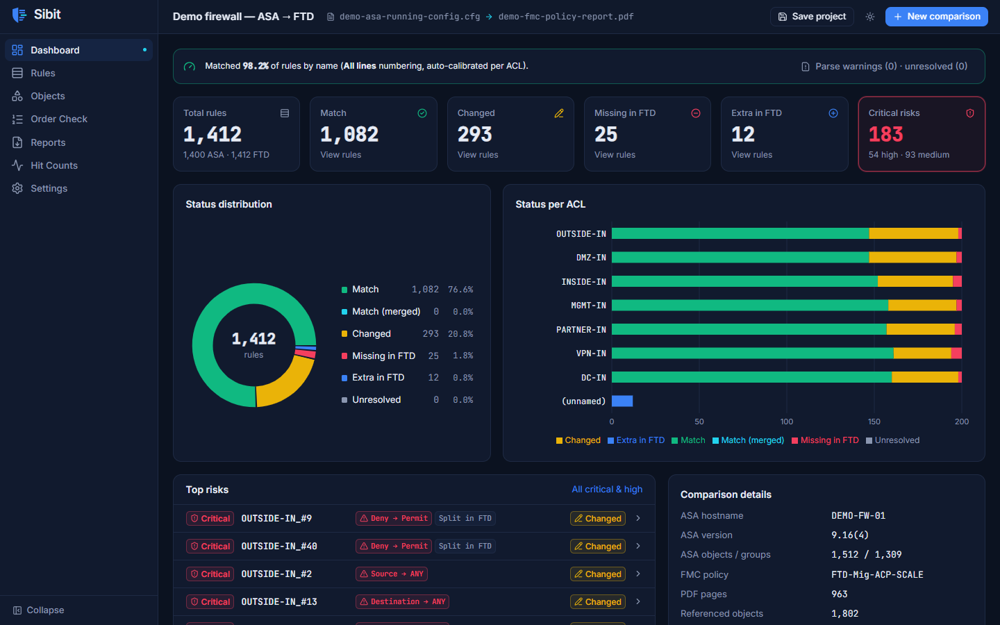
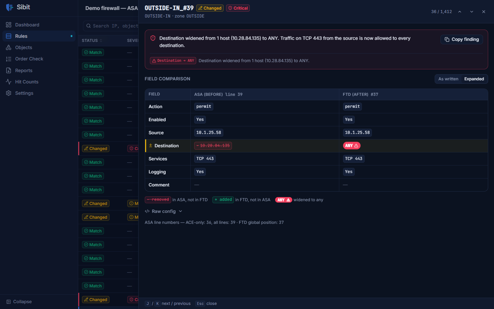
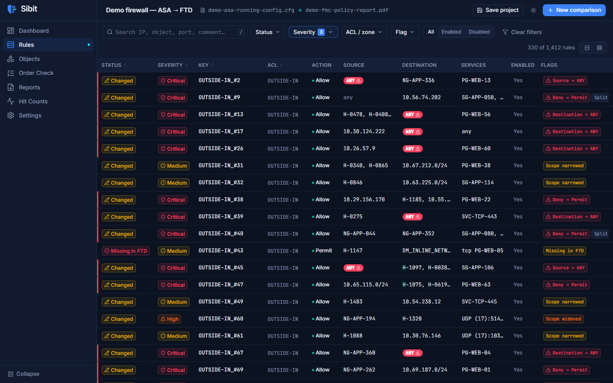
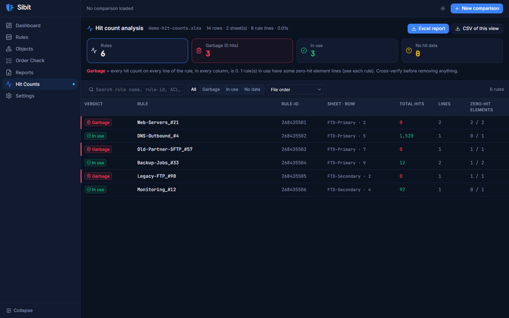
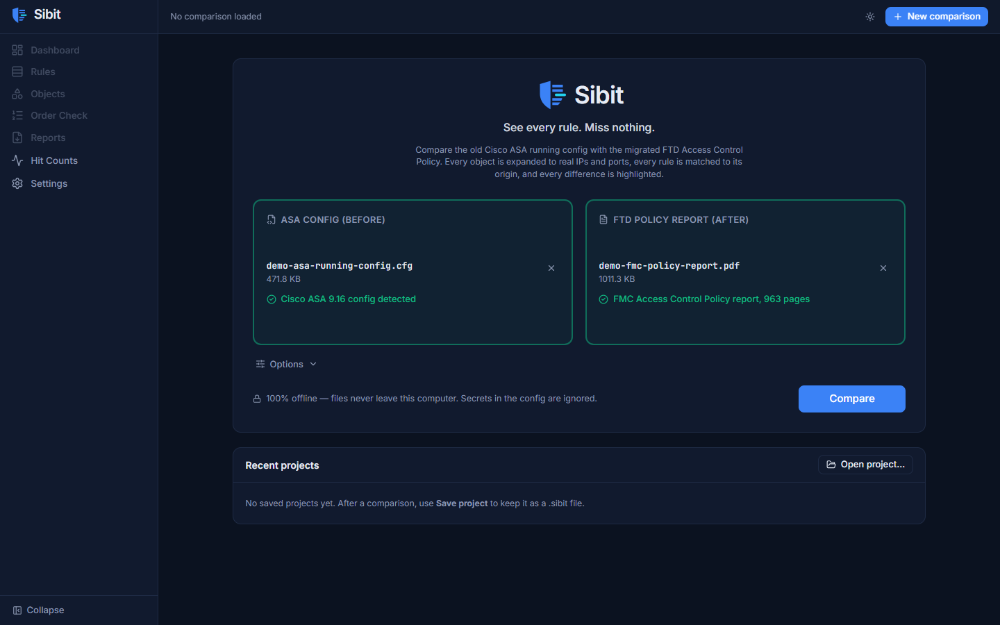

<p align="center"></p>

<p align="center"><b>See every rule. Miss nothing.</b><br>
Firewall Migration Rule Verifier — Cisco ASA running config → Cisco FTD Access Control Policy (FMC)</p>

---

Sibit compares an old **Cisco ASA running config** with the migrated **FTD Access Control Policy** (the FMC PDF report,
or an FMC REST API export). It expands every object and group on both sides to real IPs and ports, matches each FTD rule
to its ASA origin, compares them field by field, and highlights every difference. It pays special attention to rules
that became **wider** (less secure), such as a destination silently changed to `any`.

- **Deterministic and exact.** No AI or LLM features; the same inputs always give the same result.
- **100% offline.** No telemetry, CDNs or external APIs. The app listens on `127.0.0.1` only, and secrets in the config
  (passwords, keys, SNMP communities) are ignored and never displayed or exported.
- **Fast.** A 1,500-page PDF with 10,000+ rules is compared in about 15 seconds on a laptop.

## Screenshots

**Dashboard**: matching rate, KPIs, status per ACL and the top risks.


**Rule diff**: ASA (before) vs FTD (after); here the destination was widened to ANY.


**Rules**: every rule pair with filters, severity and flags.


**Hit counts**: rules with 0 hits marked as garbage.


**New comparison**: drop the ASA config and the FMC report.


*Screenshots use generated demo data, not a real firewall.*

## Quick start (Windows)

### Option A — the packaged app
Run `dist\Sibit\Sibit.exe`. A console window opens (close it to quit) and your browser opens Sibit.

### Option B — from source

Prerequisites: **Python 3.11+** and **Node.js 20+** (Node is only needed to build the UI).

```powershell
# 1. Python environment
py -3.11 -m venv .venv
.venv\Scripts\python -m pip install --upgrade pip
.venv\Scripts\pip install -e backend[dev]

# 2. Build the UI (output goes into backend\sibit\web)
cd frontend
npm install
npm run build
cd ..

# 3. Run: starts the local server and opens the browser
.venv\Scripts\python -m sibit
```

Options: `python -m sibit --port 8800 --no-browser`.

## Using Sibit

1. **New comparison**: drop the ASA config (`.cfg`/`.txt`) and the FTD policy report (`.pdf`, or an FMC REST `.json`
   export). Sibit checks each file's type ("Cisco ASA 9.14 config detected", "FMC Access Control Policy report,
   1,118 pages"). *Options* sets the numbering strategy (Auto / ACE-only / All lines) and whether to include disabled
   rules and ignore comment differences.
2. **Processing**: live progress (page X of Y, rules parsed, objects resolved). You can cancel.
3. **Dashboard**: KPIs (Critical risks first), status donut, status per ACL, the top 10 risks, the matching banner
   ("Matched 98.7% of rules by name (ACE-only numbering)"), and parse warnings.
4. **Rules**: a virtualized table of every rule pair, with filters (status, severity, ACL/zone, flag, enabled) and a
   global search. Typing `192.0.2.10` finds every rule touching that IP, including through groups. Click a row for
   the **side-by-side diff drawer**: ASA (before) vs FTD (after), *As written* / *Expanded*, removed values struck
   through in red, added values in green with `+`, `ANY ⚠` for widened rules, raw config with changed tokens
   highlighted, a plain-English risk explanation, and **Copy finding** for tickets.
   Keys: `J`/`K` next/previous, `/` search, `Esc` close.
5. **Objects**: look up any object by name or IP, see its expanded tree and the rules that use it, and the list of
   unresolved objects with reasons.
6. **Order Check**: rules whose position changed relative to a deny rule.
7. **Reports**: Excel (Summary, All Rules, Critical & High, Changed, Missing, Extra, Order Changes, Unresolved Objects),
   CSV and JSON, for all rules or only the current filtered view. Save and reopen `.sibit` project files.
8. **Hit Counts** (standalone, no comparison needed): upload `show access-list` output with hit counts — Excel with
   any number of sheets (words may sit in any columns), CSV or text. Sibit recognises the Cisco keywords
   (`RULE:`, `rule-id`, `access-list … line N`, `(hitcnt=N)`, `0x…` hashes) wherever they are, adds up every
   `hitcnt` on every row (extra columns = other devices/snapshots), and marks each rule **Garbage** (every hit count 0),
   **In use**, or **No hit data**. Table exports with a "Rule Name / Hit Count" header also work. Millions of rows are
   supported (2 million rows ≈ 1 minute). Export the result to Excel or CSV. *Cross-verify before removing rules.*
9. **Settings**: theme (dark default / light / system), density, default numbering strategy, port-name overrides.

## Command line

```powershell
# Full comparison to a report (.xlsx, .csv or .json)
python -m sibit compare "before.cfg" "after.pdf" -o report.xlsx [--numbering auto|ace_only|all_lines]

# Parser summaries (phases 1 and 2)
python -m sibit.parsers.asa samples\before.cfg --summary [--rules] [--warnings]
python -m sibit.parsers.ftd samples\after.pdf --summary [--rules] [--objects] [--warnings]

# Optional: fetch a policy from FMC's REST API into a JSON bundle (read-only; password is prompted)
python -m sibit.parsers.ftd.fmc_api --host fmc.corp.local --user api-ro --policy "FTD-Mig-ACP" -o after.json
```

`Sibit.exe` accepts the same `compare` arguments.

## Tests

The automated test suite (pytest, Vitest and an end-to-end browser test) is kept private because it is built around
confidential firewall data; it is not part of this repository.

## Building Sibit.exe

```powershell
cd frontend; npm run build; cd ..
.venv\Scripts\pyinstaller build\sibit.spec --noconfirm --distpath dist --workpath build\work
# -> dist\Sibit\Sibit.exe   (one-folder build; copy the whole dist\Sibit folder)
```

**Installer (to share Sibit):** after building `dist\Sibit`, compile the Inno Setup script
(Inno Setup 6: `winget install JRSoftware.InnoSetup`):

```powershell
& "$env:LOCALAPPDATA\Programs\Inno Setup 6\ISCC.exe" build\sibit-installer.iss
# -> dist\Sibit-Setup-1.0.0.exe  (single file, ~71 MB; installs per-user, no admin needed)
```

The icon comes from `brand\sibit.ico`. To regenerate all brand assets after changing the logo geometry, run
`.venv\Scripts\python brand\generate.py` (it needs `npm install` first, because it reads the Inter font from
`frontend\node_modules`).

## Project structure

```
sibit/
├── backend/
│   ├── sibit/
│   │   ├── __main__.py          # python -m sibit  (server + browser) / compare CLI
│   │   ├── api/                 # FastAPI routes, app state
│   │   ├── parsers/asa/         # tokenizer (secrets), objects, acl, resolver
│   │   ├── parsers/ftd/         # pdf_reader, rule_block, referenced_objects, resolver, FMC JSON source
│   │   ├── model/               # Rule, AddressSet, ServiceSet
│   │   ├── compare/             # matcher, differ, risk, order_check, engine
│   │   ├── export/              # excel.py, csv.py, json.py
│   │   ├── ports.py             # Cisco port/protocol names → numbers
│   │   ├── jobs.py              # background jobs + progress (SSE)
│   │   ├── project.py           # .sibit save/load (zip: JSON + Parquet)
│   │   └── web/                 # built UI (generated by npm run build)
├── frontend/                    # React 18 + TypeScript + Vite + Tailwind + shadcn/ui
├── brand/                       # logo SVGs, favicon, sibit.ico, generate.py
├── samples/                     # your real files — git-ignored, never commit
└── build/sibit.spec             # PyInstaller
```

## Where things are stored

| What | Where |
|---|---|
| Settings, recent projects | `%APPDATA%\Sibit\` |
| Saved projects (`.sibit`) | `Documents\Sibit\` |
| Uploaded inputs | a temp folder, deleted when the comparison finishes |

## Troubleshooting

- **"This PDF doesn't look like an FMC Access Control Policy report"**: export the report from FMC
  (*Policies → Access Control → Report*), not a screenshot or print-to-PDF of the UI.
- **Many unresolved FTD objects**: check *Objects → Unresolved* for the names. Check that the report is
  a complete FMC Access Control Policy report, including the Referenced Objects section.
- **Low name-match rate on the dashboard**: set the numbering strategy explicitly in *Options*. Rules that still don't
  match by name are matched by content and labelled *Matched by content*.
- **Port 8765 is busy**: Sibit automatically picks the next free port, or pass `--port`.

---

## Credits

Built by **Zahoor Ishfaq**, using [Claude Code](https://www.anthropic.com/claude-code) as the coding agent.
